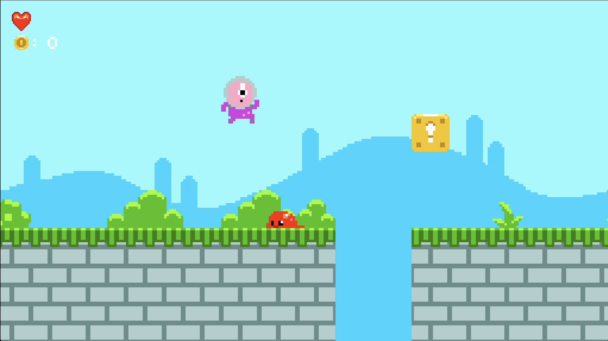

## Super Mario Bros.

! Work In Progress !

Pour la cinquième  semaine de la formation GD50 de l'université Harvard, l'objectif était de recréer le jeu Super Mario Bros avec le moteur de jeu LÖVE2D et le language de programmation Lua

Les sujets abordés sont les suivants:

- Les Tile Maps
- La détéction de collision grâce aux Tile Maps
- Les animation en 2D avec les techniques de tweening
- La génération procédurale de niveaux
- La Physique de jeu de plateformes
- L'intelligence Artificielle Basique des ennemis
- les Powerups

Pour ce projet, je me suis également mis au défi (et indépendemment du crusus de la formation) de concevoir d'une librairie Lua que j'appelle "ModuleManager" qui a pour but d'émuler le workflow modulaire qu'on peut retrouver dans le moteur de jeu Unity et Unreal. Elle permet la gestion dynamique des classes d'un objet. 

Par exemple, dans la génération procédurale d'un niveau, si je souhaite qu'une tuile vide de la Tile Map devienne solide après l'avoir instanciée, je lui rajoute tout simplement le module "Collidable".

J'ai poussé cette librairie afin que la plupart des objets du jeu utilise des modules.

Pour y jouer, vous devez tout d'abord télécharger le moteur LÖVE2D disponible ci-dessous:

https://love2d.org/#download

Vous pouvez maintenant télécharger et lancer le fichier du jeu "Pong.love".

Utiliser les flèches directionnelles pour déplacer le personnages et appuyez sur la touche espace pour sauter!

